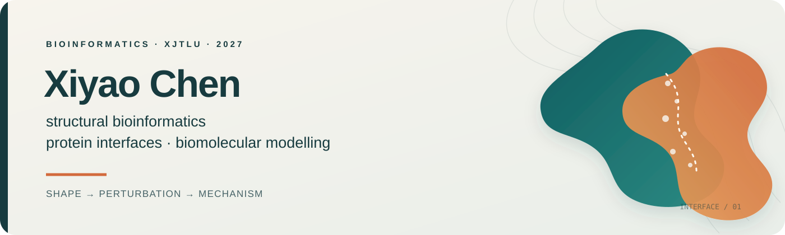
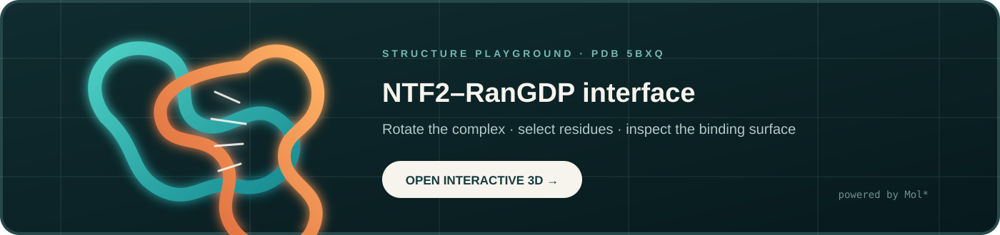

  

  
  

I am an undergraduate bioinformatics researcher at **Xi'an Jiaotong-Liverpool University (XJTLU)**, completing a BSc in Bioinformatics in 2027. My main interest is **structural bioinformatics**: turning protein shape, interfaces, mutations, and molecular motion into testable computational representations.

> **How does a small molecular perturbation become a measurable change at a protein interface?**

## Structural bioinformatics

My current work connects geometric learning with molecular simulation to study protein–protein interactions. I am especially interested in models that remain biologically interpretable when comparing a wild type with a mutation or post-translational modification.

`structure` → `interface` → `perturbation` → `dynamics` → `interpretation`

Click the structure card to rotate, select, and inspect a representative protein–protein complex in Mol*.

## Research in motion

- Building matched **WT → variant** structure lineages for mutation and PTM analysis.
- Comparing **surface-patch geometry** with graph representations for binding-affinity prediction.
- Connecting learned interface signals to **molecular-dynamics trajectories** and biophysical interpretation.

<b>How I test a structural model</b>

I care about more than a headline metric. My workflow tracks data lineage, prevents information leakage, preserves partner-swap symmetry where appropriate, and compares learned signals with structural or simulation-based evidence.

## Selected research & builds

### Protein Surface Affinity

**A representation study for protein–protein binding:** MaSIF-inspired surface patches versus an AttentiveFP graph comparator, with matched wild-type and variant structures as the next step.

[Explore the repository →](https://github.com/Ci-yo/SURF-2025-Protein-Surface-Affinity)

| Project | Project story |
|---|---|
| **[Tumour Microenvironment Explorer](https://github.com/Ci-yo/BIO215_Capstone_geneTMEpredict)** | An R Shiny workflow for exploration, batch prediction, model comparison, and input perturbation.     |
| **[Global River Methane Drivers](https://github.com/Ci-yo/SURF-2024-River-Methane-Drivers)** | A coordinate atlas and reproducible exploration of geographic and hydrological companions of river methane flux. |
| **[Arabidopsis RNA-seq](https://github.com/Ci-yo/BIO211_CW2_RNAseq)** | An end-to-end route from read quality and alignment to differential expression and biological interpretation. |
| **[Palm Skin Microbiome](https://github.com/Ci-yo/BIO211_CW3_Microbiome)** | A reproducible metagenomic analysis linking community structure and diversity to focused biological questions. |

<b>Earlier work: RNA modification & statistical genomics</b>

A SURF project introduced me to cross-technology m6A evidence, calibration, domain shift, and careful validation. A related implementation is the **[m6A Site Prediction](https://github.com/Ci-yo/BIO215_P3_m6APrediction)** project.

<b>Research toolkit</b>

| Lens | Tools |
|---|---|
| **Modelling** | Python · PyTorch · PyTorch Geometric · scikit-learn |
| **Structure** | MaSIF-style features · FoldX · PyMOL · AMBER/AmberTools · PDB utilities |
| **Genomics** | R · DESeq2 · STAR · StringTie · reproducible omics workflows |
| **Research engineering** | Linux · Git/GitHub · SLURM/HPC · Shiny · Quarto |

## Away from the keyboard

🏹 I train in **barebow archery**—a useful reminder that precision comes from repeatable form, honest error analysis, and changing one variable at a time.

  <i>Building computational ways to see what changes at a biological interface.</i>

